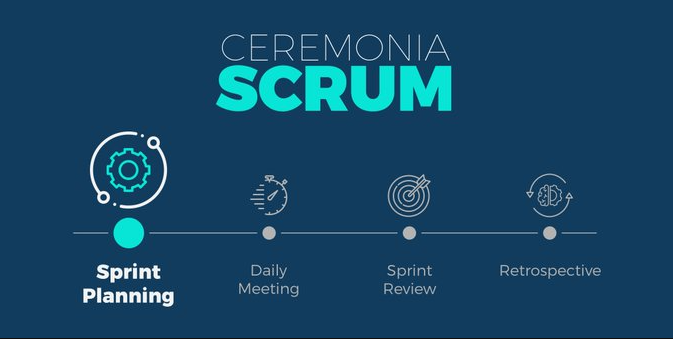
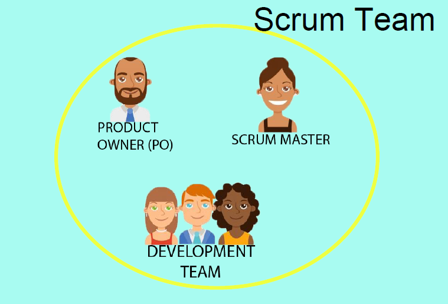

# 2022-06-Proyecto-Integrador
Proyecto donde trabajaremos 10 alumnos del aula 6. Cohorte 2022. ISPC. Desarrollo Web.

# Ceremonias, Artefactos y Roles de SCRUM #
Scrum es un marco de trabajo muy utilizado en la actualidad para utilizar en proyectos de todo ámbito en grupo, de forma colaborativa e incremental para el logro de objetivos entregables de manera pronta y en crecimiento constante.

# Ceremonias SCRUM #

Son reuniones que se realizan con fines específicos, entre los integrantes del grupo y/o los involucrados directa e indirectamente en el proyecto.

**Reunión de planificación del Sprint o Sprint Planning Meeting:** Se produce al iniciar el Sprint y tiene como objetivo decidir que se hará. :clock12:

**Daily Scrum Meeting:** Se produce diariamente durante máximo 20 min. El objetivo es hablar sobre lo que se hizo, qué se va a hacer y 
qué problemas se han encontrado.

**Review Metting:** Se realiza al finalizar el Sprint y tiene como meta mostrar que es lo que se ha completado y que no.

**Sprint Retrospective Meeting:** También se celebra cuando se termina el Sprint y se realiza para documentar que funcionó y que no durante la duración del mismo. Se trata de mejorar para el próximo Sprint, viendo que salió bien y que debe mejorar para seguir.

# Artefactos SCRUM #

Son todos aquellos elementos físicos que se producen como resultado de la aplicación de Scrum, y estos son:
    ● Product Backlog
    ● Sprint Backlog
    ● Incremento

## Product Backlog ##

El Product Backlog un inventario que contiene cualquier tipo de trabajo que haya que hacer en el producto: requerimientos,funcionalidades, correccion de Bugs, casos de uso, historias de usuario, tareas técnicas, trabajo de investigación y dependencias.
Ademas, es la principal fuente de información sobre el producto en Scrum y contiene todos lo que necesitamos para desarrollar el mismo.

## Sprint Backlog ##

Es una lista de elementos en los que trabajar durante la etapa del Sprint, gestionada por el equipo de desarrollo. Estos elementos se componen de tareas más pequeñas que permiten conseguir un incremento de software determinado.

## Incremento ##

Es el resultado del Sprint, es la suma de todas las tareas, casos de uso, historias de usuario y cualquier elemento que se haya desarrollado durante el Sprint y que será puesto a disposición del usuario final en forma de software, aportando un valor de negocio al producto que se está desarrollando.

# Roles #

En la metodologia SCRUM se diferencian 3 roles:
    ●      SCRUM MASTER 
    ●      PRODUCT OWNER 
    ●      EQUIPO DE DESARROLLO y TESTEO 

## Scrum Master ##

El Scrum Master es el encargado de asegurar que la metodología se lleve a cabo tal y como está definida. Esto se logra haciendo que cada persona del equipo entienda la teoría y práctica de la metodología.

La persona con el rol de Scrum Master sirve al equipo de Scrum de varias formas:

    ●       Orienta a los miembros del equipo en la autogestión y la multifuncionalidad.
    ●       Ayuda a los equipos a enfocarse en crear incrementos de alto valor que cumplan con la definición de Terminado.
    ●       Remueve los impedimentos de progreso que pudiera tener el equipo.
    ●       Asegura que todos los eventos de Scrum se lleven a cabo y que sean positivos, productivos y dentro de los tiempos establecidos.

El Scrum Master también colabora con el propietario del producto de las siguientes maneras:

    ●       Ayuda a encontrar técnicas para definir efectivamente el objetivo del producto y la gestión de la pila de producto.
    ●       Ayuda a que los miembros del equipo entiendan los artículos de la pila de producto.
    ●       Ayuda a establecer un planeamiento del producto de manera empírica para entornos que sean complejos.

Finalmente también colabora con el resto de la organización con actividades como:

    ●       Liderar, planear y entrenar a los miembros de la organización en lo que respeta a la adopción de Scrum .
    ●       Planear y aconsejar cómo implementar Scrum dentro de la organización.
    ●       Ayudar a los empleados a comprender y llevar a cabo la práctica de la metodología, mediante un enfoque empírico para trabajos complejos.

Durante la reunión de planificación de Sprint, el Scrum Master deberá desempeñar las siguientes funciones:

    ●       Realizar esta reunión antes de cada Sprint .
    ●       Asegurar que se cuenta con una pila de producto preparada por el propietario del producto.
    ●       Ayudar a mantener el diálogo entre el propietario del producto y los desarrolladores.
    ●       Asegurar que se llegue a un acuerdo entre el propietario del producto y los desarrolladores con respecto a lo que incluirá el incremento.
    ●       Ayudar a comprender la visión y las necesidades de negocio del cliente.
    ●       Asegurar que se ha realizado una descomposición y estimación del trabajo realistas.
    ●       Asegurar que al final de la reunión estén determinados los siguientes puntos:

            Los ítems de la pila de producto que se van a ejecutar
            El objetivo del Sprint .
            La pila de Sprint con todas las tareas estimadas.
            La duración del Sprint y la fecha de reunión de revisión.
            La definición de Terminado que determinará que el incremento está listo.

## Product Owner ##

Este actor tiene la responsabilidad de decidir que trabajo necesita hacerse y maximizar el valor del producto o proyecto que se esté llevando a cabo.
Siendo más específicos, estas son las tareas que debe realizar este rol: gestiona los presupuestos y las prioridades, contrata al equipo de desarrollo, representa el negocio en sí, tomando decisiones por sí mismo si tiene la autoridad necesaria o consultando a alguien más, representándolo; además debe poder medir el valor generado e ir flexibilizando en caso que sea necesario, el trabajo a desarrollar en los Sprints dependiendo del tiempo y otras variables.

##  Equipo de Desarrollo y Testeo ##

 Es el tercer de los roles en scrum y el mismo se compone de todas las personas que cuentan con conocimientos necesarios y que se encargan de construir el incremento de producto en cada sprint.
Para lograr que los incrementos de producto resulten efectivo se necesita que todos los integrantes del equipo tengan en claro y presente la visión del producto. Tal es así que los equipos estables tienden a conocer mejor su capacidad, lo que hace posible que la organización tenga cierta previsibilidad. A su vez la forma mas eficiente y efectiva de comunicar información dentro de un equipo de desarrollo es mediante la comunicación cara a cara.
Por ultimo tenemos lo que es el testeo o prueba de software, que cada miembro del equipo de desarrollo puede realizarlo para poder chequear que el software continúa funcionando de manera correcta.

